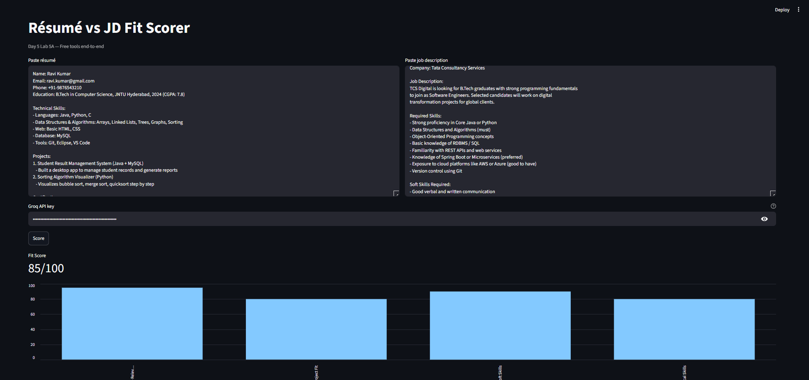

# ai-bootcamp - SRINIJA PULLIPUDI

## Day 1 — Setup complete

- ✅ Google AI Studio API key provisioned
- ✅ Groq API key provisioned
- ✅ Hello-Gemini call working — see [Day1_Setup.ipynb](Day1_Setup.ipynb)
- 4-tool comparison matrix from Lab 1A: see screenshot below

## Day 4 — n8n Daily News Digest

- ✅ Self-hosted n8n via Docker
- ✅ Workflow: Schedule (7AM IST) → RSS → Gemini summariser → Gmail
- ✅ Workflow JSON committed: [Day4_NewsDigest.json](Day4_NewsDigest.json)
- ✅ Test email screenshot below

## Day 5 — Résumé Scorer Streamlit

**Live URL:** [https://<your-app>.streamlit.app](https://resumescorer-q8c9sdqbvznp9pkema5ptv.streamlit.app/)
**Code:** app.py  |  **Acceptance log:** acceptance_log.md
**Tools:** Continue.dev + Groq (llama-3.1-8b-instant) + Streamlit Community Cloud

### Features
- Fit score with rationale
- 4-axis bar chart breakdown (technical skills, soft skills, experience relevance, project fit)
- Missing skills + free learning resources with direct links

### Reflection
- **Vibe vs engineered:** Vibe-coded. To productionise, I'd add caching, rate limiting per user, and better error handling for when Groq returns malformed JSON.
- **What Continue.dev did well:** Scaffolded the Streamlit layout fast and generated both the bar chart and learning resources sections in one prompt update.
- **What I had to fix:** Continue.dev introduced indentation errors when adding new features — had to manually correct the prompt block and missing skills section back to the right indent level. Also had to switch from Gemini to Groq due to 503 availability issues, and update the model from the decommissioned llama3-8b-8192 to llama-3.1-8b-instant.

